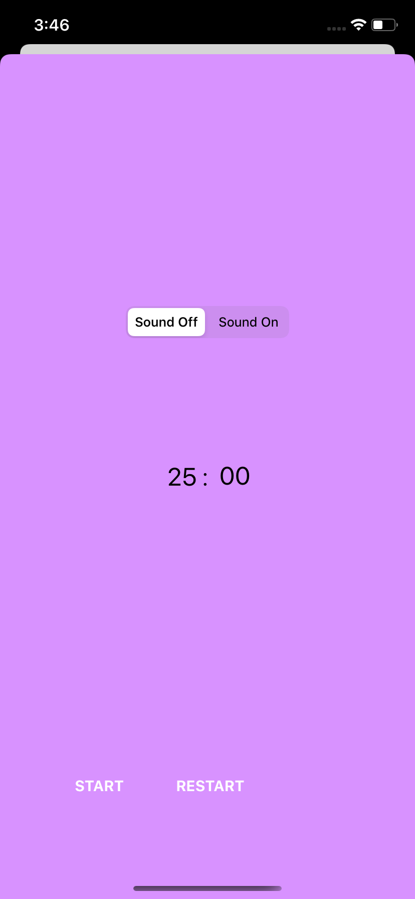

# To-DoWithPromodoro

This was the first project I have ever made on iOS. It is a clone of a to-do list app that I like to use. 

- You can make to-do lists for different categories. 
- You can update category and task names, delete them, and mark tasks as done.
- If you click on a task, it will lead you to promodoro page. Promodoro is a technique that you work on your task for 25 minutes and gives break for 5 minutes. 
- There are a timer and a sound option on that page. 
- You can make the sound on to have calming music in the background as you work. 
- Finally, there is a list of completed tasks. 

With this project, I learned things like UITableView, UICollectionView, and Segues. 
But the biggest gaining for me was studying with Core Data as a local database and learning what dependency injection is.

    
  

